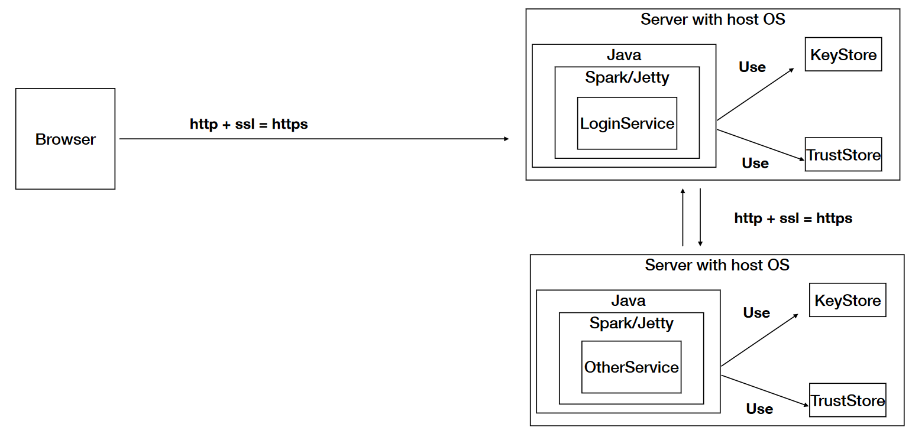
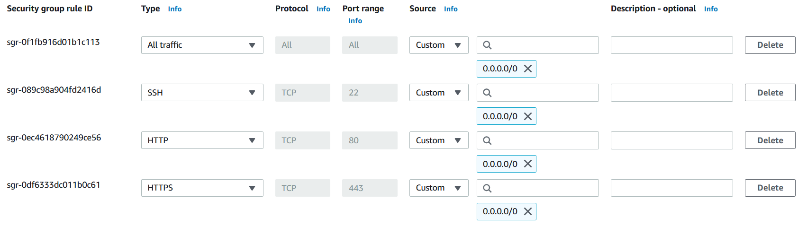
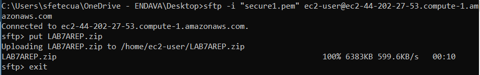
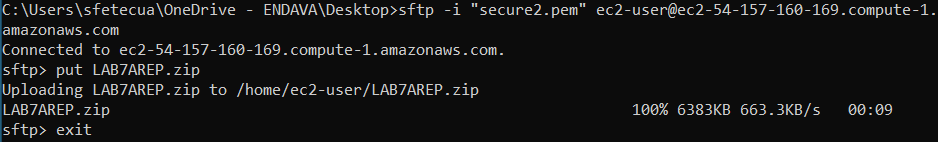
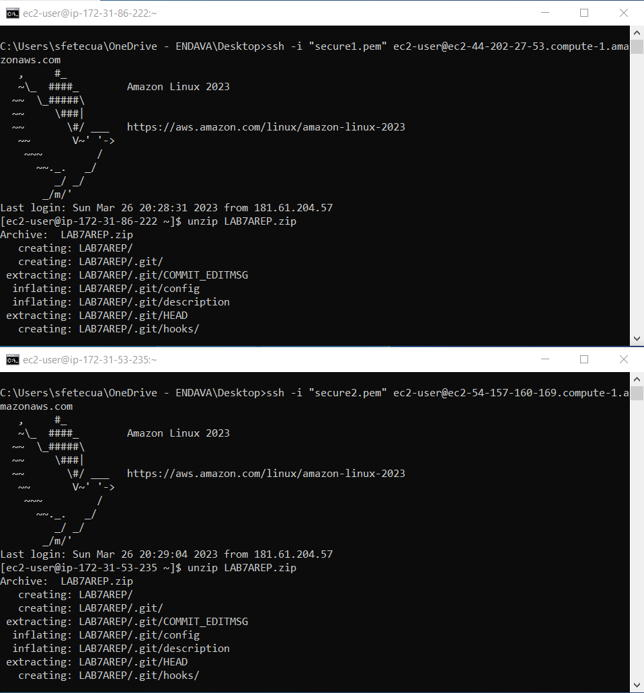
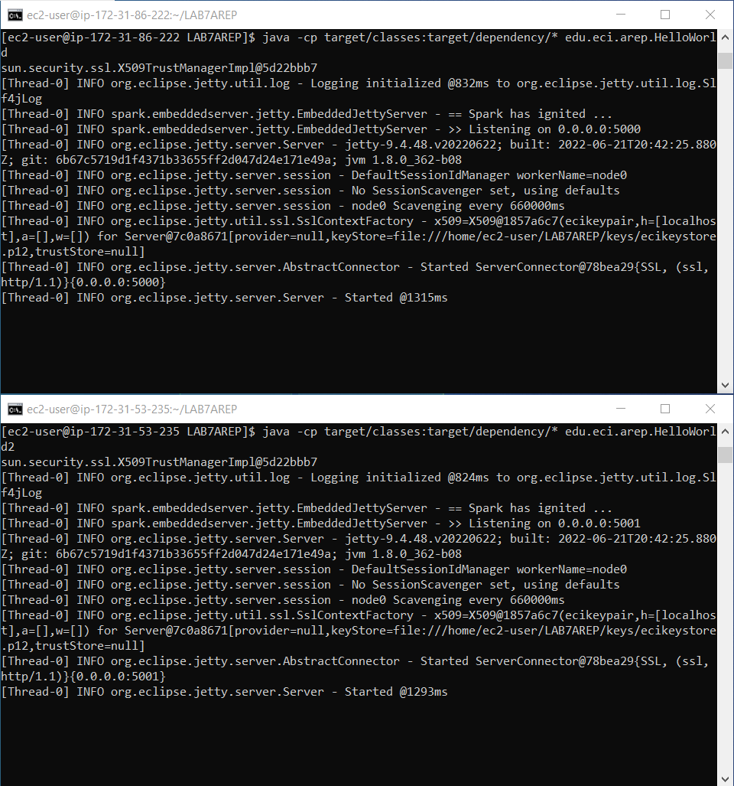
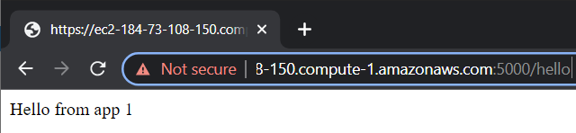
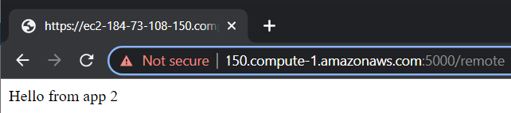
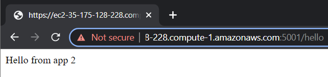
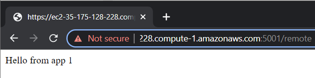

# LAB7AREP

Septimo taller de la asignatura, en este se aplicaron conocimientos de HTTPS, Spark, AWS, MAVEN, GIT.

## Prerrequisitos

Para ejecutar el laboratorio se necesitó tener instalado:

```
- Java
- Maven
- Git
```

## Arquitectura



## Procedimiento AWS

Para cumplir la con la arquitectura propuesta se siguió el siguiente proceso:

* Se hicieron las respectivas modificaciones al codigo hecho en clase para que funcionara en AWS.

* Se crearon las instancias EC2 en AWS, a cada maquina se le asignó una IP y se congiguró el grupo de seguridad para que permitiera el trafico y las conexiones necesarias.



* Por medio del protocolo SFPT se transfirio el archivo zip con el proyecto a cada una de las maquinas.





* Luego por medio de SSH se accedió a las maquinas y se descomprimió el archivo zip en cada una.



* Para correr el poryecto en cada una de las maquinas se usaron los comandos: 
    
    ```
    java -cp target/classes:target/dependency/* edu.eci.arep.HelloWorld
    ```

    ```
    java -cp target/classes:target/dependency/* edu.eci.arep.HelloWorld2
    ```



* Se accedió a las maquinas con las respectivas direcciones de AWS y se comprobó que funcionaba correctamente.

Maquina 1





Maquina 2





## Video

[Video](https://drive.google.com/file/d/1kSSD70we7DnjCQYPhoxUiPX5WEUw5pwZ/view?usp=sharing)

## Documentación

Para generar la documentación del proyecto se debe ejecutar el siguiente comando

```
mvn javadoc:javadoc
```
Para ver la documentación se debe abrir el archivo index.html que se encuentra en la carpeta target/site/apidocs

## Estructura del proyecto

```
.
│   .gitignore
│   pom.xml
│   README.md
│
├───keys
│       awskeystore.p12
│       awskeystore2.p12
│       ecicert.cer
│       ecikeystore.p12
│       myTrustStore.p12
│
├───src
│   ├───main
│   │   └───java
│   │       └───edu
│   │           └───eci
│   │               └───arep
│   │                       App.java
│   │                       HelloWorld.java
│   │                       HelloWorld2.java
│   │                       SecureURLReader.java
│   │
│   └───test
│       └───java
│           └───edu
│               └───eci
│                   └───arep
│                           AppTest.java
│

```

## Construido con

* [Maven](https://maven.apache.org/) - Dependency Management
* [JAVA](https://www.java.com/es/download/) - Lenguaje de programación
* [GIT](https://git-scm.com/) - Control de versiones
* [AWS](https://aws.amazon.com/es/) - Servicios en la nube

## Autor

* **Santiago Fetecua** - [santiago-f20](https://github.com/santiago-f20)